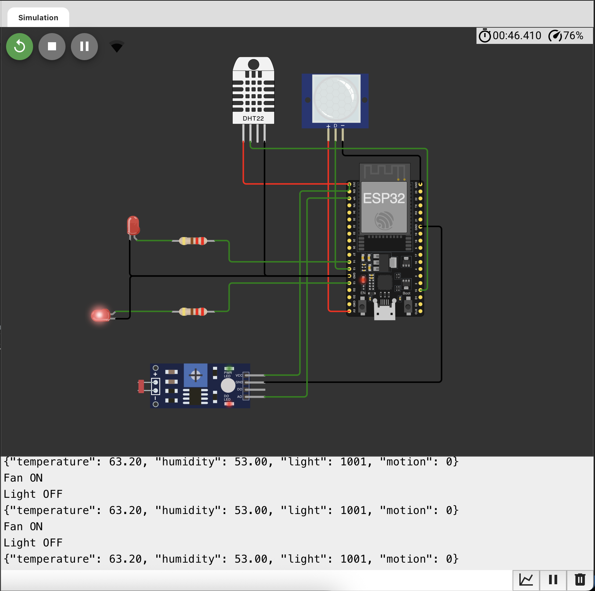

# Smart Home Controller – IoT Monitoring & Automation System

## Project Description

This project simulates a smart home environment using:
- Sensors: DHT22 (temperature/humidity), Photoresistor (light), PIR (motion)
- Actuators: LEDs for fan and light
- Cloud: Node-RED dashboard for real-time monitoring, Ubidots for remote data storage
- Protocol: MQTT for communication between devices and dashboard

## Architecture

```
Wokwi (ESP32) →
  MQTT (HiveMQ Broker) →
    Node-RED Dashboard →
      Automation Logic + Ubidots Cloud
```

## Components Used

| Component       | Role                                |
|----------------|--------------------------------------|
| ESP32 (Wokwi)   | Microcontroller simulation           |
| DHT22           | Temperature & Humidity sensor        |
| PIR sensor      | Motion detection                     |
| Photoresistor   | Ambient light detection              |
| LEDs            | Simulated fan and light control      |
| Node-RED        | Visualization + automation rules     |
| Ubidots         | Cloud storage and graphing           |
| HiveMQ          | MQTT broker                          |

## Step 1: ESP32 Setup in Wokwi

1. Go to https://wokwi.com and create a new ESP32 project.
2. Wire the components:
   - DHT22 → GPIO 15
   - PIR → GPIO 12
   - Photoresistor → VP (GPIO 36)
   - LEDs → GPIO 13 (Fan), GPIO 14 (Light)
3. Use Arduino libraries:
   ```
   WiFi.h
   PubSubClient.h
   DHTesp.h
   ```



## Step 2: Node-RED Setup

1. Install and open Node-RED at http://localhost:1880
2. Install `node-red-dashboard` via Menu → Manage Palette
3. Create a flow:
   - MQTT IN node for topic `home/sensors`
   - JSON → Function nodes to extract values
   - Display Temperature, Humidity, Light, Motion in dashboard
   - Add logic with `switch` and `function`:
     - Temperature > 30 → Fan ON
     - Motion == 1 and Light < 400 → Light ON

## Step 3: LED Automation Logic

### Fan Rule
```
IF temperature > 30 → Turn on Fan (LED on GPIO 13)
```

### Light Rule
```
IF motion == 1 AND light < 400 → Turn on Light (LED on GPIO 14)
```

## Step 4: Ubidots Cloud Integration

1. Register at https://ubidots.com and get your API token
2. Create a blank device named `smarthome`
3. In Node-RED:
   - Add a `function` node:
     ```js
     msg.headers = {
       "X-Auth-Token": "YOUR_TOKEN",
       "Content-Type": "application/json"
     };
     msg.payload = {
       temperature: msg.payload.temperature,
       humidity: msg.payload.humidity,
       light: msg.payload.light,
       motion: msg.payload.motion
     };
     msg.url = "https://industrial.api.ubidots.com/api/v1.6/devices/smarthome/";
     msg.method = "POST";
     return msg;
     ```
   - Add an `http request` node after it
   - Leave URL field empty; use values from `msg`

## View Dashboard

Open:
```
http://localhost:1880/ui
```

## Notes

- Full simulation on Wokwi (no physical ESP32 required)
- Node-RED used for real-time UI and automation
- Ubidots adds remote monitoring and analytics

This project demonstrates an end-to-end IoT system using open and free tools.
